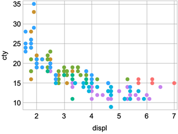

# ggplot: A grammar of graphics implementation for Wolfram Language

A Wolfram Language implementation of the Grammar of Graphics, inspired by R's ggplot2. This library provides a layered approach to creating statistical graphics by combining data, aesthetic mappings, geometric objects, scales, and themes.

## General usage

```
ggplot[dataset, "x" -> "var", "y" -> "var", additional aesthetics and geoms...]

ggplot["data" -> dataset, "x" -> "var", "y" -> "var", additional aesthetics and geoms...]

dataset //
    ggplot["x" -> "var", "y" -> "var", additional aesthetics and geoms...]
```

## Currently supported geoms

```
geomPoint[]
geomLine[]
geomPath[]
geomSmooth[]
geomParityLine[]
geomHLine[]
geomVLine[]
```

## Currently supported scales

```
scaleXLinear2[]
scaleXLog2[]
scaleXDate2
scaleYLinear2[]
scaleYLog2[]
scaleYDate2
```

## Major functionality still to work or working through:

- Ability to use functions inside aesthetics (i.e. "color" -> `Function[#var < 8]`)
- Also need to be able to use functions inside x and y (i.e. "x" -> `Function[#x * 5]`)
- Scaling (ensure correct functionality and continue to add additional scaling functions)
- Legends
- Faceting
- geoms other than lines and points (columns, histograms, box plots etc.)
- Textual axes (for things like bar chart)
- Coordinates
- Labels

## Examples

```
mpg//ggplot[geomPoint["x"->"displ","y"->"cty","color"->"class"]]
```


```
economics//
	ggplot[
		"x"->"date","y"->"uempmed",geomLine[],scaleXDate2[]
	]
```


---

## Design Philosophy & Architecture

This library implements the Grammar of Graphics as a layered system where each component has a specific responsibility. The core philosophy follows these principles:

### 1. **Separation of Concerns**
- **Data Layer**: Raw datasets (lists of associations)
- **Aesthetic Layer**: Visual mappings (color, size, shape, position)
- **Geometry Layer**: Visual representations (points, lines, bars)
- **Scale Layer**: Data transformations (linear, log, discrete, date)
- **Theme Layer**: Overall visual styling

### 2. **Functional Composition**
All components are functions that can be composed together. The main `ggplot` function orchestrates this composition by:
- Parsing arguments and extracting components
- Creating scale functions for coordinate transformations
- Applying aesthetic mappings to data
- Generating graphics primitives from geoms
- Assembling the final `Graphics` object

### 3. **Immutable Data Flow**
Data flows through the system without modification:
```
Raw Data → Aesthetic Reconciliation → Scale Functions → Graphics Primitives → Final Plot
```

---

## Core Architecture Components

### Main Entry Point: `ggplot.m`

The `ggplot` function is the central orchestrator that:

1. **Argument Processing**: Uses `HoldAllComplete` to capture unevaluated expressions
2. **Scale Resolution**: Determines x/y scale types (Linear, Log, Date, Discrete)
3. **Scale Function Creation**: Builds transformation functions for coordinate mapping
4. **Geom Processing**: Collects and processes all geometric objects
5. **Graphics Assembly**: Combines all elements into a `Graphics` object

**Key Pattern**: Scale functions are passed to geoms via options:
```wolfram
geomPoint[opts, FilterRules[options, Options[geomPoint]], 
  "xScaleFunc" -> xScaleFunc, "yScaleFunc" -> yScaleFunc]
```

### Aesthetic System: `aes*.m` files

Aesthetics handle visual mappings through the `reconcileAesthetics` function pattern:

```wolfram
reconcileAesthetics[dataset_, mapping_, aestheticType_]
```

**Input Types Supported**:
- `Null`: Uses default values
- Direct values: `"color" -> Red` 
- Column references: `"color" -> "species"`
- Functions: `"color" -> Function[#price > 100]`

**Output**: Dataset with added aesthetic columns (e.g., `"color_aes"`, `"size_aes"`)

### Geometry System: `geom*.m` files

Each geom follows a consistent pattern:

1. **Validation**: Check required aesthetics (x, y)
2. **Data Preparation**: Handle date conversion, aesthetic reconciliation
3. **Grouping**: Group data by aesthetic combinations
4. **Primitive Generation**: Create Wolfram graphics primitives
5. **Optimization**: Apply performance optimizations (e.g., `GeometricTransformation`)

**Standard Options Pattern**:
```wolfram
Options[geomSomething] = {
  "data" -> {}, "x" -> Null, "y" -> Null,
  "color" -> Null, "alpha" -> Null, 
  "xScaleFunc" -> Function[Identity[#]], 
  "yScaleFunc" -> Function[Identity[#]]
}
```

### Scale System: `scale*.m` files

Scales determine how data values map to visual coordinates:

- **Discrete Scales**: Map categorical data to integer positions
- **Continuous Scales**: Apply mathematical transformations (log, linear)
- **Date Scales**: Handle temporal data conversion

**Key Functions**:
- `reconcileXScales`/`reconcileYScales`: Determine scale type from arguments
- `createDiscreteScaleFunc`: Build categorical → numeric mappings
- `discreteScaleQ`: Detect if data should use discrete scaling

### Theme System: `themes.m`

Themes set global visual defaults by modifying Wolfram's `Options` system:

```wolfram
ggplotSetTheme[themeName] := Module[{},
  SetOptions[ggplot, (* graphics options *)];
  SetOptions[ticks2, (* tick styling *)];
  SetOptions[gridLines2, (* grid styling *)];
]
```

#### Shape Configuration

Themes now support configurable shape palettes through the `"categoricalShapes"` option:

```wolfram
SetOptions[ggplot, 
  "categoricalShapes" -> {"\[FilledCircle]", "\[FilledUpTriangle]", "\[FilledSquare]", ...}
]
```

**Key Features:**
- **Dynamic Length**: No longer limited to 7 shapes - use as many as needed
- **Automatic Cycling**: When there are more groups than shapes, the system automatically cycles through the available shapes
- **Theme-Specific**: Each theme can define its own default shape palette
- **Customizable**: Users can override shape palettes using `SetOptions[ggplot, "categoricalShapes" -> {...}]`

**Example:**
```wolfram
(* Set a custom shape palette *)
SetOptions[ggplot, "categoricalShapes" -> {
  "\[EmptyCircle]", "\[EmptySquare]", "\[EmptyUpTriangle]", 
  "\[EmptyDiamond]", "\[Times]", "+"
}];

(* This will use the shapes in order, cycling if needed *)
ggplot[data, geomPoint["x" -> "xvar", "y" -> "yvar", "shape" -> "groupvar"]]
```

---

## How to Extend the Library

### Adding a New Geom

1. **Create the file**: `ggplot/geomNewGeom.m`

2. **Follow the standard pattern**:

```wolfram
BeginPackage["ggplot`"];
Begin["`Private`"];

Options[geomNewGeom] = {
  "data" -> {}, "x" -> Null, "y" -> Null,
  "color" -> Null, "alpha" -> Null,
  "xScaleFunc" -> Function[Identity[#]], 
  "yScaleFunc" -> Function[Identity[#]]
};

geomNewGeom[opts : OptionsPattern[]] /; Count[Hold[opts], ("data" -> _), {0, Infinity}] > 0 := 
Module[{newDataset, output},
  (* Validate required aesthetics *)
  If[OptionValue["x"] === Null, Message[ggplot::xOrYNotGiven]; Throw[Null];];
  
  newDataset = OptionValue["data"];
  
  (* Handle date conversion *)
  newDataset = Replace[newDataset, d_?DateObjectQ :> AbsoluteTime[d], Infinity];
  
  (* Reconcile aesthetics *)
  newDataset = reconcileAesthetics[newDataset, OptionValue["color"], "color"];
  newDataset = reconcileAesthetics[newDataset, OptionValue["alpha"], "alpha"];
  
  (* Generate graphics primitives *)
  output = newDataset // Map[{
    #["color_aes"],
    #["alpha_aes"],
    (* Your primitive here, e.g.: *)
    YourPrimitive[OptionValue["xScaleFunc"][#[OptionValue["x"]]], 
                 OptionValue["yScaleFunc"][#[OptionValue["y"]]]]
  } &];
  
  output
];

End[];
EndPackage[];
```

3. **Register in the system**:
   - Add to `ggplot/Kernel/init.m`: `Get["ggplot`geomNewGeom`"];`
   - Add to `ggplotSymbolDeclaration.m`: `geomNewGeom::usage = "TBD";`
   - Add to `argPatternQ` in `ggplot.m`: `| geomNewGeom[___]`
   - Add geom processing in main `ggplot` function

### Adding a New Aesthetic

1. **Create the file**: `ggplot/aesNewAesthetic.m`

2. **Implement the reconciliation patterns**:

```wolfram
BeginPackage["ggplot`"];
Begin["`Private`"];

(* Default case *)
reconcileAesthetics[dataset_, Null, "newAesthetic"] := Module[{newDataset},
  newDataset = dataset;
  newDataset = newDataset // Map[Append[#, "newAesthetic_aes" -> defaultValue] &];
  newDataset
];

(* Direct value case *)
reconcileAesthetics[dataset_, value_, "newAesthetic"] := Module[{newDataset},
  newDataset = dataset;
  newDataset = newDataset // Map[Append[#, "newAesthetic_aes" -> value] &];
  newDataset
];

(* Column reference case *)
reconcileAesthetics[dataset_, key_?StringQ, "newAesthetic"] /; keyExistsQAll[dataset, key] := 
Module[{newDataset, data, aestheticFunc, discreteDataQ},
  newDataset = dataset;
  data = newDataset[[All, key]];
  discreteDataQ = isDiscreteDataQ[data];
  
  (* Implement your mapping logic here *)
  aestheticFunc = If[discreteDataQ, 
    discreteMappingFunction[data],
    continuousMappingFunction[data]
  ];
  
  newDataset = newDataset // Map[Append[#, "newAesthetic_aes" -> aestheticFunc[#[key]]] &];
  newDataset
];

(* Function case *)
reconcileAesthetics[dataset_, func_Function, "newAesthetic"] := Module[{newDataset, groupedDataset, values},
  newDataset = dataset;
  groupedDataset = GroupBy[dataset, func] // KeySort;
  values = (* generate appropriate values for each group *);
  newDataset = groupedDataset // Values // MapIndexed[
    Function[{group, index}, 
      Map[Function[row, Append[row, "newAesthetic_aes" -> values[[First@index]]]], group]
    ]
  ] // Flatten;
  newDataset
];

End[];
EndPackage[];
```

3. **Register the aesthetic**:
   - Add to `ggplot/Kernel/init.m`
   - Update relevant geom options to include the new aesthetic
   - Update geom implementations to call `reconcileAesthetics` for the new aesthetic

### Adding a New Scale

1. **Create scale detection logic** in `scale.m`:

```wolfram
reconcileXScales[args___] /; Count[args, scaleXNewScale[___], Infinity] > 0 := "NewScale";
reconcileYScales[args___] /; Count[args, scaleYNewScale[___], Infinity] > 0 := "NewScale";
```

2. **Implement scale functions** in the appropriate scale file:

```wolfram
(* In ticks.m *)
ticks2["NewScale", min_?NumericQ, max_?NumericQ, opts : OptionsPattern[]] := 
  (* Return tick specification *);

(* In gridLines.m *)
gridLines2["NewScale", min_?NumericQ, max_?NumericQ, opts : OptionsPattern[]] := 
  formatGridLines[ticks2["NewScale", min, max, opts], opts];
```

3. **Update scale function creation** in `ggplot.m`:

```wolfram
xScaleFunc = If[xScaleType == "Discrete",
  createDiscreteScaleFunc["x", heldArgs],
  With[{f = ToExpression[xScaleType /. "Linear" | "Date" | "NewScale" -> "Identity"]}, 
    Function[f[#]]
  ]
];
```

### Adding a New Theme

Create a new theme function in `themes.m`:

```wolfram
ggplotSetTheme[ggplotThemeNewTheme] := Module[{},
  SetOptions[ggplot,
    (* Set all ggplot graphics options *)
    ImageSize -> 400,
    AspectRatio -> 7/10,
    Frame -> True,
    (* ... more options ... *)
  ];
  SetOptions[ticks2,
    (* Set tick styling options *)
    numberOfMajorTicks2 -> 6,
    majorTickStyle2 -> Directive[Black, Thickness[0.001]],
    (* ... more options ... *)
  ];
  SetOptions[gridLines2, Options[ticks2]];
  SetOptions[formatTicks, Options[ticks2]];
  SetOptions[formatGridLines, Options[ticks2]];
  $ggplotTheme = ggplotThemeNewTheme;
  Print["Set theme to ggplotThemeNewTheme"]
];
```

---

## Key Design Patterns

### 1. **Option Pattern Consistency**
All functions use Wolfram's `OptionsPattern[]` with string-based keys for consistency with the grammar of graphics syntax.

### 2. **Hold Attributes**
Functions that need to inspect argument structure use `HoldAllComplete` or `HoldAll` to prevent premature evaluation.

### 3. **Module-Based Isolation**
Each function uses `Module` to create local variable scopes, preventing naming conflicts.

### 4. **Error Handling with Messages**
Custom message definitions provide user-friendly error reporting:
```wolfram
ggplot::xOrYNotGiven = "A geom was given without specifying the x or y mapping";
```

### 5. **Graphics Primitive Lists**
All geoms return lists of graphics primitives that can be combined in the final `Graphics` object.

### 6. **Functional Data Processing**
Heavy use of functional programming patterns (`Map`, `GroupBy`, `Cases`, `Select`) for data transformation.

---

## Development Guidelines

### Code Organization
- One concept per file (geom, aesthetic, scale type)
- Consistent naming: `geomName`, `aesName`, `scaleName`
- Private context for implementation details

### Performance Considerations
- Use `GeometricTransformation` for repeated similar primitives
- Group data operations to minimize passes through datasets
- Leverage Wolfram's optimized functions where possible

### Testing Strategy
- Test with different data types (numeric, string, date)
- Verify scale function behavior across ranges
- Check aesthetic mapping with edge cases

This architecture provides a flexible foundation that closely mirrors the grammar of graphics while leveraging Wolfram Language's strengths in symbolic computation and graphics generation.

---

## Detailed Component Interaction Analysis

### System Architecture Overview

The ggplot system follows a layered architecture with clear separation of concerns:

```
User Input → ggplot.m (orchestrator) → {Aesthetics, Geoms, Scales, Legends, Facets} → Graphics Output
```

### Component Interactions

#### **A. ggplot.m as Central Orchestrator**

The main `ggplot` function acts as the central coordinator that:

1. **Parses arguments** using pattern matching to extract:
   - Dataset (`"data" -> {}`)
   - Aesthetic mappings (`"x" -> "variable"`, `"color" -> "category"`)
   - Geom specifications (`geomPoint[]`, `geomLine[]`)
   - Scale functions (`scaleXLog2[]`)
   - Faceting requests (`facetWrap[]`)

2. **Creates scaling functions** by calling:
   - `reconcileXScales[heldArgs]` and `reconcileYScales[heldArgs]`
   - `createDiscreteScaleFunc[]` for categorical data
   - Scale functions transform data coordinates to plot coordinates

3. **Processes each geom** by:
   - Passing the dataset, aesthetics, and scale functions to each geom
   - Each geom returns graphics primitives that are collected into `graphicsPrimitives`

4. **Generates legends** by calling `extractLegendInfo[]` and `convertLegendInfo[]`

5. **Handles faceting** by delegating to `createFacetedGraphics[]`

#### **B. Aesthetic System (`reconcileAesthetics`)**

The aesthetic system is implemented through a **dispatch pattern** where `reconcileAesthetics[dataset, mapping, aestheticType]` has multiple definitions:

**For each aesthetic (color, shape, size, alpha, group):**

```wolfram
(* Handle null/missing values *)
reconcileAesthetics[dataset_, Null, "color"] := (* Default color *)

(* Handle constant values *)
reconcileAesthetics[dataset_, color_?ColorQ, "color"] := (* Fixed color for all points *)

(* Handle column mappings *)
reconcileAesthetics[dataset_, key_?StringQ, "color"] := (* Map from data column *)

(* Handle function mappings *)
reconcileAesthetics[dataset_, func_Function, "color"] := (* Apply function to determine color *)
```

**Key Process:**
1. Each geom calls `reconcileAesthetics` for every aesthetic it supports
2. The function adds `"aesthetic_aes"` columns to the dataset (e.g., `"color_aes"`, `"size_aes"`)
3. These columns contain the actual visual values (colors, sizes, shapes) that will be used in rendering

#### **C. Geom System**

Each geom follows a **consistent pattern**:

```wolfram
Options[geomX] = {"data" -> {}, "x" -> Null, "y" -> Null, (* aesthetic options *), "xScaleFunc" -> Function[Identity[#]], "yScaleFunc" -> Function[Identity[#]]};

geomX[opts : OptionsPattern[]] := Module[{newDataset, output},
  (* 1. Validate required aesthetics *)
  If[OptionValue["x"] === Null || OptionValue["y"] === Null, Message[ggplot::xOrYNotGiven]; Throw[Null];];
  
  (* 2. Get dataset *)
  newDataset = OptionValue["data"];
  
  (* 3. Apply aesthetic reconciliation *)
  newDataset = reconcileAesthetics[newDataset, OptionValue["color"], "color"];
  newDataset = reconcileAesthetics[newDataset, OptionValue["size"], "size"];
  (* ... other aesthetics ... *)
  
  (* 4. Generate graphics primitives *)
  output = newDataset // Map[Function[row, 
    (* Create graphics primitives using row data and scale functions *)
  ]];
  
  output
]
```

#### **D. Legend System**

The legend system operates in **three phases**:

1. **Extraction**: `extractLegendInfo[]` scans the held arguments to find aesthetic mappings
2. **Reconciliation**: Uses the same `reconcileAesthetics` functions to ensure legend colors/shapes match the plot
3. **Grouping**: `combineLegendsForSameVariable[]` merges legends when multiple aesthetics map to the same variable

#### **E. Faceting System**

Faceting creates multiple subplot panels by:
1. **Detecting facet requests** in `ggplot.m`
2. **Splitting the dataset** by faceting variable
3. **Creating separate plots** for each facet with consistent scales
4. **Arranging subplots** in a grid layout

#### **F. Scale System**

Scales handle coordinate transformations:
1. **Scale detection**: `reconcileXScales` and `reconcileYScales` determine if data is discrete, continuous, date, or log
2. **Function creation**: Scale functions transform data values to plot coordinates
3. **Tick/grid generation**: Scales also control axis ticks and grid lines

### Current Issues and Inconsistencies

#### **A. Aesthetic System Issues**

1. **Inconsistent Discrete/Continuous Detection**
   - Each aesthetic file has its own logic for determining if data is discrete
   - `isDiscreteDataQ` exists in `aes.m` but isn't consistently used across all aesthetics
   - **Example**: Shape aesthetic rejects continuous data, but size aesthetic handles both

2. **Redundant Code Patterns**
   - Similar logic repeated across `aesColor.m`, `aesSize.m`, `aesShape.m`, `aesAlpha.m`
   - Each file implements its own discrete value sorting and mapping

3. **Faceting Compatibility Issues**
   - Aesthetic functions check for existing `"*_aes"` columns to avoid overwrites
   - This suggests fragility in how faceting interacts with aesthetics

#### **B. Legend System Issues**

1. **Complex Legend Combination Logic**
   - The system tries to combine multiple aesthetics mapping to the same variable
   - This logic is complex and may not handle edge cases well
   - Limited support for continuous legends (only color is well-supported)

2. **Inconsistent Legend Extraction**
   - Legend extraction reimplements aesthetic logic instead of reusing `reconcileAesthetics`
   - This creates potential for legends to not match actual plot appearance

#### **C. Geom System Issues**

1. **Code Duplication**
   - Every geom has similar boilerplate for validation, aesthetic reconciliation
   - No shared base class or common functionality

2. **Complex Grouping Logic in geomLine**
   - `geomLine` has especially complex logic for handling group aesthetics
   - The grouping logic tries to handle both explicit groups and color-based grouping
   - This creates maintenance challenges and potential bugs

#### **D. Scale System Issues**

1. **Limited Scale Types**
   - Only supports discrete, linear, log, and date scales
   - No support for custom scale transformations

2. **Discrete Scale Limitations**
   - Discrete scales use integer mappings which may not be optimal for all use cases
   - Limited control over discrete scale ordering

#### **E. Error Handling Issues**

1. **Inconsistent Error Messages**
   - Some functions use `Message[]` + `Throw[]`, others use `Echo[]` + `Throw[]`
   - Error messages are defined globally but not consistently used

2. **Limited Validation**
   - Minimal input validation beyond basic type checking
   - No validation of data consistency across aesthetics

### Areas for Improvement

#### **A. Aesthetic System Refactoring**

1. **Create Common Base Functions**
   ```wolfram
   (* Centralized discrete/continuous detection *)
   determineAestheticType[data_] := (* consistent logic *)
   
   (* Common mapping function *)
   mapAestheticValues[data_, type_, palette_] := (* reusable mapping *)
   ```

2. **Standardize Aesthetic Patterns**
   - Create a common template for aesthetic implementations
   - Reduce code duplication by extracting shared functionality

#### **B. Legend System Improvements**

1. **Simplify Legend Logic**
   - Reuse `reconcileAesthetics` for legend creation instead of reimplementing
   - Standardize continuous legend support across all aesthetics

2. **Better Legend Positioning**
   - More flexible legend positioning options
   - Automatic legend sizing based on content

#### **C. Geom System Enhancements**

1. **Create Geom Base Class**
   ```wolfram
   createGeomBase[geomName_, requiredAesthetics_, optionalAesthetics_] := 
     (* Generate common boilerplate *)
   ```

2. **Simplify Group Handling**
   - Extract grouping logic into shared functions
   - Standardize how all geoms handle group aesthetics

#### **D. Scale System Expansion**

1. **Add More Scale Types**
   - Custom transformation functions
   - Reverse scales
   - Binned scales for continuous data

2. **Improve Discrete Scales**
   - Better control over ordering
   - Support for missing values
   - More flexible label formatting

#### **E. Error Handling Standardization**

1. **Consistent Error Patterns**
   ```wolfram
   validateRequired[opts_, required_] := (* standard validation *)
   throwError[message_] := (* standard error throwing *)
   ```

2. **Better User Feedback**
   - More descriptive error messages
   - Suggestions for fixing common issues

#### **F. Performance Optimizations**

1. **Reduce Data Copying**
   - Current system creates many intermediate dataset copies
   - Optimize aesthetic reconciliation to minimize copying

2. **Lazy Evaluation**
   - Only compute aesthetics that are actually used
   - Cache expensive computations like color palette generation

### Recommended Architecture Changes

1. **Extract Common Interfaces**
   - Define standard interfaces for aesthetics, geoms, and scales
   - This would improve consistency and enable easier extension

2. **Implement Plugin Architecture**
   - Allow easy addition of new geoms, aesthetics, and scales
   - Standardize the registration and discovery of new components

3. **Add Configuration Management**
   - Better theme system with inheritance
   - Global configuration that's easier to modify and extend

4. **Improve Data Pipeline**
   - More explicit data flow with better intermediate representations
   - Reduce the complexity of the main ggplot orchestration function

### Summary

The current system works but shows signs of organic growth without sufficient refactoring. The core concepts are sound, but implementation consistency and maintainability could be significantly improved through the architectural changes outlined above. The dispatch-based aesthetic system is elegant but needs standardization, and the geom system would benefit from reduced duplication and shared functionality.